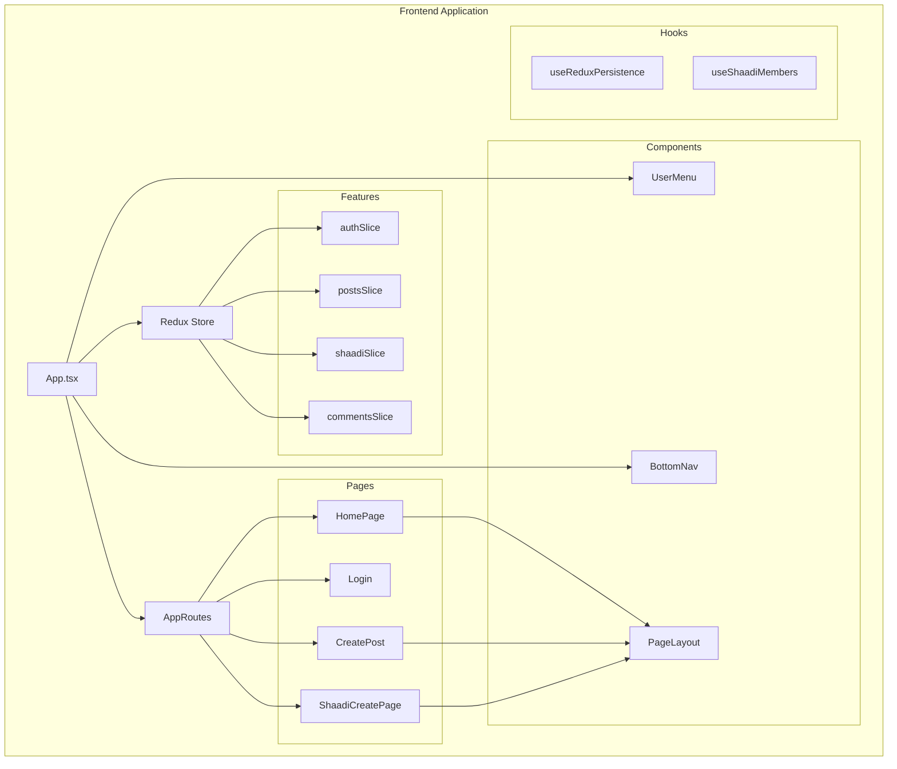
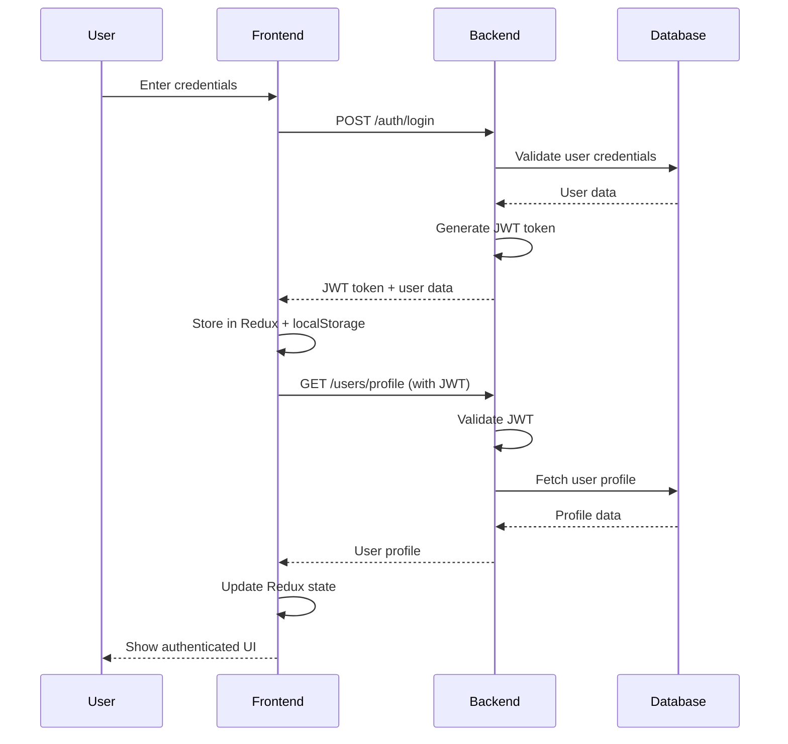
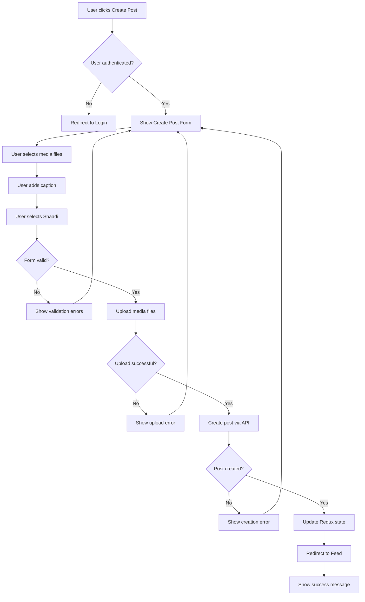
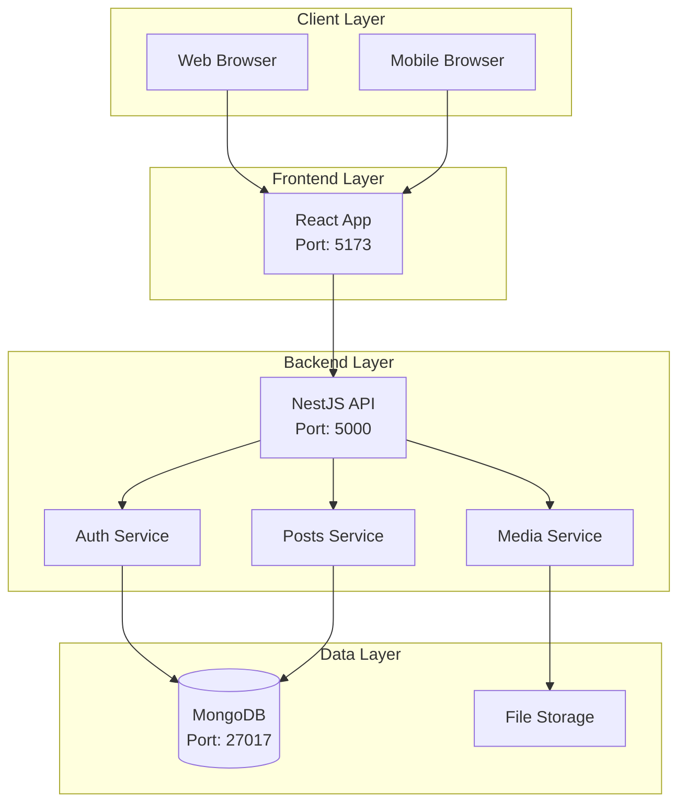

# WebMediaFeed Application Architecture Documentation

## Table of Contents
1. [Overview](#overview)
2. [Architecture Patterns](#architecture-patterns)
3. [Technology Stack](#technology-stack)
4. [System Architecture](#system-architecture)
5. [Frontend Architecture](#frontend-architecture)
6. [Backend Architecture](#backend-architecture)
7. [Database Design](#database-design)
8. [Security Architecture](#security-architecture)
9. [Deployment Architecture](#deployment-architecture)
10. [UML Diagrams](#uml-diagrams)

## Overview

WebMediaFeed is a social media application specifically designed for wedding celebrations (Shaadi), allowing users to create, manage, and share wedding-related content. The application follows a modern, scalable architecture with clear separation of concerns.

### Key Features
- User authentication and authorization
- Wedding event management (Shaadi)
- Media sharing and posting
- Guest invitation system
- Real-time feed updates
- Role-based access control

## Architecture Patterns

### 1. **Layered Architecture (Backend)**
- **Controller Layer**: Handles HTTP requests and responses
- **Service Layer**: Contains business logic
- **Data Access Layer**: Manages database operations
- **Domain Layer**: Contains business entities and schemas

### 2. **Component-Based Architecture (Frontend)**
- **Atomic Design**: Components are organized by complexity
- **Container/Presenter Pattern**: Separation of logic and presentation
- **Custom Hooks**: Business logic extracted into reusable hooks

### 3. **Microservices-Ready Architecture**
- **Module-based Structure**: Each feature is a separate module
- **Loose Coupling**: Modules communicate through well-defined interfaces
- **Scalable Design**: Easy to extract into separate services

### 4. **Event-Driven Architecture**
- **Redux State Management**: Centralized state with predictable updates
- **Real-time Updates**: Polling mechanism for feed updates
- **Reactive UI**: Components react to state changes

## Technology Stack

### Frontend
- **Framework**: React 19 with TypeScript
- **State Management**: Redux Toolkit
- **Styling**: Styled Components + Material-UI
- **Routing**: React Router DOM
- **Build Tool**: Vite
- **Testing**: Vitest + React Testing Library

### Backend
- **Framework**: NestJS (Node.js)
- **Language**: TypeScript
- **Database**: MongoDB with Mongoose ODM
- **Authentication**: JWT + Passport
- **Validation**: Class-validator + Class-transformer
- **Testing**: Jest

### Infrastructure
- **Database**: MongoDB
- **File Storage**: Local file system (with abstraction layer)
- **CORS**: Enabled for cross-origin requests
- **Environment**: Configurable through environment variables

## System Architecture

```
┌─────────────────┐    ┌─────────────────┐    ┌─────────────────┐
│   Frontend      │    │   Backend       │    │   Database      │
│   (React)       │◄──►│   (NestJS)      │◄──►│   (MongoDB)     │
│                 │    │                 │    │                 │
│ • User Interface│    │ • API Gateway   │    │ • User Data     │
│ • State Mgmt    │    │ • Business Logic│    │ • Shaadi Data   │
│ • Routing       │    │ • Auth Service  │    │ • Posts Data    │
│ • Components    │    │ • File Storage  │    │ • Media Data    │
└─────────────────┘    └─────────────────┘    └─────────────────┘
```

## Frontend Architecture

### Component Structure
```
src/
├── components/           # Reusable UI components
│   ├── common/          # Shared components (Header, Footer, etc.)
│   ├── [Feature]/       # Feature-specific components
│   │   ├── index.tsx    # Main component
│   │   ├── styled.ts    # Styled components
│   │   └── use[Name].ts # Custom hook
├── pages/               # Page components
├── features/            # Redux slices
├── hooks/               # Custom hooks
├── services/            # API services
├── utils/               # Utility functions
└── styles/              # Global styles and theme
```

### State Management Architecture
```
┌─────────────────┐    ┌─────────────────┐    ┌─────────────────┐
│   Components    │    │   Redux Store   │    │   LocalStorage  │
│                 │◄──►│                 │◄──►│                 │
│ • Dispatch      │    │ • Auth Slice    │    │ • Persistence   │
│ • Select State  │    │ • Posts Slice   │    │ • State Backup  │
│ • React to      │    │ • Shaadi Slice  │    │ • Offline       │
│   Changes       │    │ • Comments      │    │   Support       │
└─────────────────┘    └─────────────────┘    └─────────────────┘
```

## Backend Architecture

### Module Structure
```
src/
├── modules/             # Feature modules
│   ├── auth/           # Authentication & Authorization
│   ├── users/          # User management
│   ├── shaadi/         # Wedding event management
│   ├── posts/          # Content management
│   ├── comments/       # Comment system
│   ├── media/          # File handling
│   └── ai/             # AI features
├── common/              # Shared utilities
├── config/              # Configuration
└── database/            # Database setup
```

### Service Layer Pattern
```
┌─────────────────┐    ┌─────────────────┐    ┌─────────────────┐
│   Controller    │    │     Service     │    │   Repository    │
│                 │◄──►│                 │◄──►│                 │
│ • HTTP Handling │    │ • Business      │    │ • Data Access   │
│ • Validation    │    │   Logic         │    │ • Database      │
│ • Response      │    │ • Orchestration │    │   Operations    │
│   Formatting    │    │ • Error Handling│    │ • Caching       │
└─────────────────┘    └─────────────────┘    └─────────────────┘
```

## Database Design

### Entity Relationships
```
User (1) ──── (N) Shaadi (1) ──── (N) Post (1) ──── (N) Comment
  │              │                    │
  │              │                    └── (N) Media
  │              └── (N) ShaadiMember
  └── (N) Invite
```

### Schema Design Principles
- **Normalization**: Proper data normalization to avoid redundancy
- **Indexing**: Strategic indexing for performance
- **Soft Deletes**: Data preservation with logical deletion
- **Timestamps**: Automatic creation and update tracking
- **References**: Proper foreign key relationships

## Security Architecture

### Authentication Flow
```
1. User Login → 2. Validate Credentials → 3. Generate JWT → 4. Return Token
     ↓
5. Client stores token → 6. Include in requests → 7. Validate on server
```

### Security Measures
- **JWT Tokens**: Stateless authentication
- **Password Hashing**: bcrypt for secure storage
- **Input Validation**: Class-validator for request validation
- **CORS Configuration**: Controlled cross-origin access
- **Role-based Access**: Granular permission system

## Deployment Architecture

### Development Environment
```
┌─────────────────┐    ┌─────────────────┐    ┌─────────────────┐
│   Frontend      │    │   Backend       │    │   MongoDB       │
│   (Vite Dev)    │    │   (NestJS Dev)  │    │   (Local)       │
│   Port: 5173    │◄──►│   Port: 5000    │◄──►│   Port: 27017   │
└─────────────────┘    └─────────────────┘    └─────────────────┘
```

### Production Considerations
- **Environment Variables**: Configuration management
- **Static File Serving**: Optimized asset delivery
- **Database Connection**: Connection pooling and optimization
- **Error Handling**: Comprehensive error logging
- **Monitoring**: Health checks and metrics

## UML Diagrams

### 1. Class Diagram - Core Entities

```mermaid
classDiagram
    class User {
        +String username
        +String email
        +String passwordHash
        +String profilePicUrl
        +String phone
        +String gender
        +Date createdAt
        +Date updatedAt
        +createShaadi()
        +createPost()
        +createComment()
    }

    class Shaadi {
        +String name
        +String brideName
        +String groomName
        +Date date
        +String location
        +String image
        +ObjectId createdBy
        +Boolean isDeleted
        +Date deletedAt
        +ObjectId deletedBy
        +String deleteReason
        +createPost()
        +inviteGuest()
    }

    class Post {
        +ObjectId userId
        +ObjectId shaadiId
        +String[] mediaUrls
        +String[] mediaTypes
        +String caption
        +ObjectId[] likes
        +String[] tags
        +addLike()
        +removeLike()
        +addComment()
    }

    class Comment {
        +ObjectId postId
        +ObjectId userId
        +String content
        +Date createdAt
        +Date updatedAt
    }

    class Invite {
        +ObjectId shaadiId
        +String contact
        +String status
        +Date sentAt
        +Date respondedAt
    }

    User ||--o{ Shaadi : creates
    User ||--o{ Post : creates
    User ||--o{ Comment : creates
    Shaadi ||--o{ Post : contains
    Post ||--o{ Comment : has
    Shaadi ||--o{ Invite : sends
```

### 2. Component Diagram - Frontend Architecture



### 3. Sequence Diagram - User Authentication Flow



### 4. Activity Diagram - Post Creation Flow



### 5. Deployment Diagram - System Infrastructure



## Design Decisions and Rationale

### 1. **NestJS Backend Framework**
- **Reason**: Provides a structured, scalable architecture with built-in support for TypeScript, dependency injection, and modular design
- **Benefits**: Easy testing, clear separation of concerns, enterprise-ready patterns

### 2. **MongoDB as Database**
- **Reason**: Flexible schema for social media content, easy scaling, and good performance for read-heavy operations
- **Benefits**: Schema evolution, horizontal scaling, JSON-like document structure

### 3. **Redux Toolkit for State Management**
- **Reason**: Centralized state management with predictable updates, essential for complex social media application state
- **Benefits**: DevTools integration, middleware support, performance optimization

### 4. **Component-Based Architecture**
- **Reason**: Reusable, maintainable UI components that follow React best practices
- **Benefits**: Code reusability, easier testing, better developer experience

### 5. **Custom Hooks Pattern**
- **Reason**: Separation of business logic from UI components, following React best practices
- **Benefits**: Reusable logic, easier testing, cleaner components

### 6. **JWT Authentication**
- **Reason**: Stateless authentication suitable for scalable applications
- **Benefits**: No server-side sessions, easy to scale, secure token-based auth

### 7. **Modular Backend Architecture**
- **Reason**: Easy to maintain, test, and scale individual features
- **Benefits**: Clear boundaries, independent development, easier deployment

## Performance Considerations

### Frontend
- **Code Splitting**: Route-based code splitting for better initial load
- **Memoization**: React.memo and useMemo for expensive computations
- **Lazy Loading**: Components loaded on demand
- **State Persistence**: Redux state persisted to localStorage

### Backend
- **Database Indexing**: Strategic indexes for common queries
- **Connection Pooling**: Efficient database connections
- **File Upload Optimization**: Image compression and validation
- **Caching Strategy**: Redux state caching on frontend

## Scalability Considerations

### Horizontal Scaling
- **Stateless Backend**: Easy to scale across multiple instances
- **Database Sharding**: MongoDB supports horizontal scaling
- **Load Balancing**: Frontend can be served from CDN
- **Microservices Ready**: Current architecture can be easily split

### Vertical Scaling
- **Database Optimization**: Proper indexing and query optimization
- **Memory Management**: Efficient state management in Redux
- **Asset Optimization**: Image compression and lazy loading

## Testing Strategy

### Frontend Testing
- **Unit Tests**: Component and hook testing with Vitest
- **Integration Tests**: Redux store and API integration
- **E2E Tests**: User workflow testing

### Backend Testing
- **Unit Tests**: Service and controller testing
- **Integration Tests**: Database and API testing
- **E2E Tests**: Complete API workflow testing

## Monitoring and Logging

### Frontend Monitoring
- **Error Boundaries**: React error boundary components
- **Performance Monitoring**: React DevTools Profiler
- **State Monitoring**: Redux DevTools

### Backend Monitoring
- **Health Checks**: Application health endpoints
- **Error Logging**: Comprehensive error logging
- **Performance Metrics**: Response time monitoring

## Future Enhancements

### Planned Improvements
- **Real-time Updates**: WebSocket integration for live updates
- **Push Notifications**: Mobile push notification support
- **Advanced Analytics**: User engagement metrics
- **AI Features**: Content moderation and recommendations
- **Mobile App**: React Native application
- **Cloud Storage**: Migration to cloud file storage

### Architecture Evolution
- **Microservices**: Split into separate services
- **Event Sourcing**: Implement event-driven architecture
- **CQRS**: Command Query Responsibility Segregation
- **API Gateway**: Implement API gateway pattern
- **Service Mesh**: Container orchestration with service mesh

---

*This document provides a comprehensive overview of the WebMediaFeed application architecture. For specific implementation details, refer to the individual component documentation and code comments.* 