# WebMediaFeed Application - Comprehensive UML Diagrams

This document contains detailed UML diagrams for different aspects of the WebMediaFeed application architecture.

## Table of Contents
1. [Database Schema Diagram](#database-schema-diagram)
2. [API Endpoints Diagram](#api-endpoints-diagram)
3. [Authentication Flow Diagram](#authentication-flow-diagram)
4. [State Management Flow](#state-management-flow)
5. [File Upload Flow](#file-upload-flow)
6. [Shaadi Management Flow](#shaadi-management-flow)
7. [Post Creation Flow](#post-creation-flow)
8. [Invitation System Flow](#invitation-system-flow)
9. [Component Hierarchy Diagram](#component-hierarchy-diagram)
10. [Service Layer Architecture](#service-layer-architecture)
11. [Use Case Diagram](#use-case-diagram)

---

## Database Schema Diagram

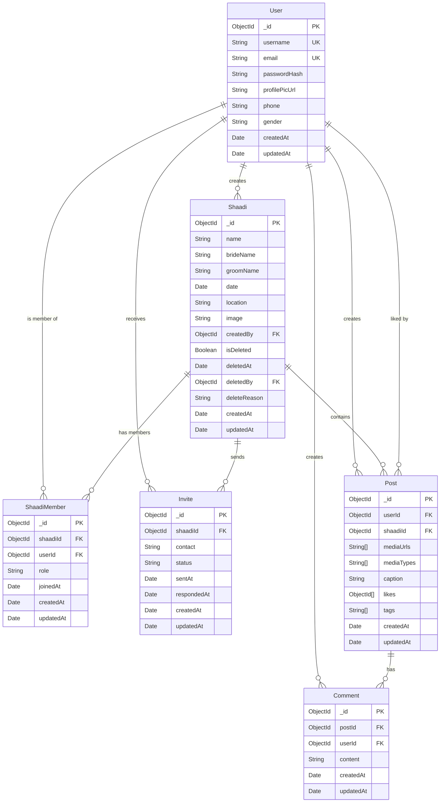

---

## API Endpoints Diagram

```mermaid
graph TB
    subgraph "Authentication Endpoints"
        A1[POST /auth/login]
        A2[POST /auth/register]
        A3[GET /auth/profile]
        A4[POST /auth/refresh]
    end

    subgraph "User Management"
        U1[GET /users/profile]
        U2[PUT /users/profile]
        U3[POST /users/upload-avatar]
        U4[GET /users/search]
    end

    subgraph "Shaadi Management"
        S1[POST /shaadi/create]
        S2[GET /shaadi/user-shaadis]
        S3[GET /shaadi/:id]
        S4[PUT /shaadi/:id]
        S5[DELETE /shaadi/:id]
        S6[POST /shaadi/:id/join]
        S7[POST /shaadi/:id/leave]
    end

    subgraph "Post Management"
        P1[POST /posts/create]
        P2[GET /posts/shaadi/:shaadiId]
        P3[PUT /posts/:id]
        P4[DELETE /posts/:id]
        P5[POST /posts/:id/like]
        P6[DELETE /posts/:id/like]
    end

    subgraph "Comment Management"
        C1[POST /posts/:id/comments]
        C2[GET /posts/:id/comments]
        C3[PUT /comments/:id]
        C4[DELETE /comments/:id]
    end

    subgraph "Invitation Management"
        I1[POST /invites/send]
        I2[GET /invites/shaadi/:shaadiId]
        I3[PUT /invites/:id/status]
        I4[DELETE /invites/:id]
        I5[POST /invites/:id/resend]
    end

    subgraph "Media Management"
        M1[POST /media/upload]
        M2[GET /media/:filename]
        M3[DELETE /media/:filename]
    end

    subgraph "AI Features"
        AI1[POST /ai/generate-caption]
        AI2[POST /ai/moderate-content]
        AI3[POST /ai/suggest-tags]
    end

    A1 --> A3
    A2 --> A3
    A3 --> U1
    S1 --> S2
    S2 --> S3
    S3 --> P2
    P1 --> P2
    P2 --> C2
    P3 --> C1
    S1 --> I1
    I1 --> I2
    P1 --> M1
    M1 --> AI1
```

---

## Authentication Flow Diagram

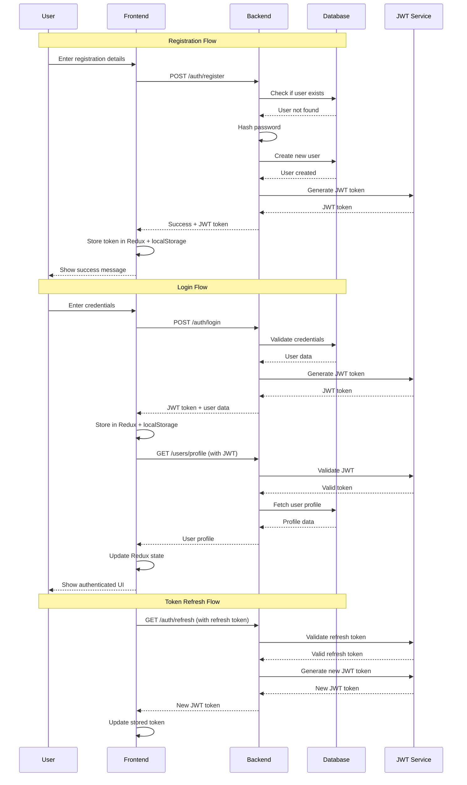

---

## State Management Flow

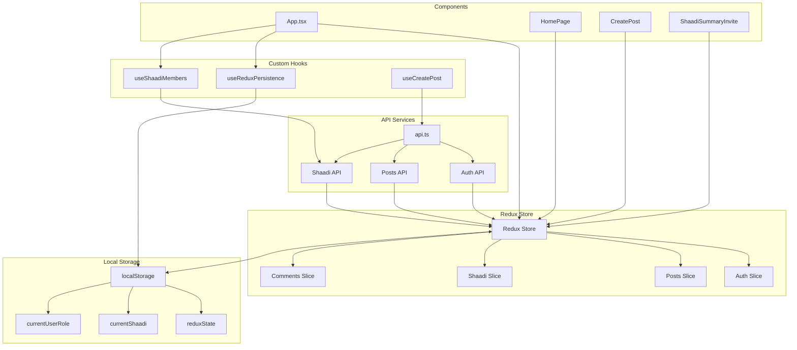

---

## File Upload Flow

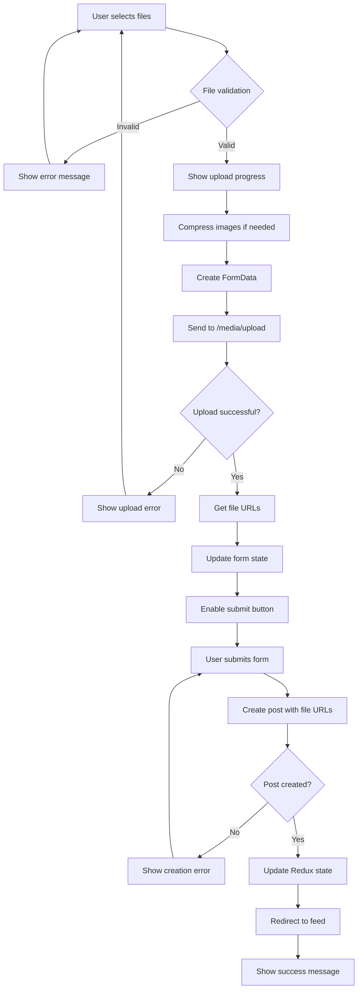

---

## Shaadi Management Flow

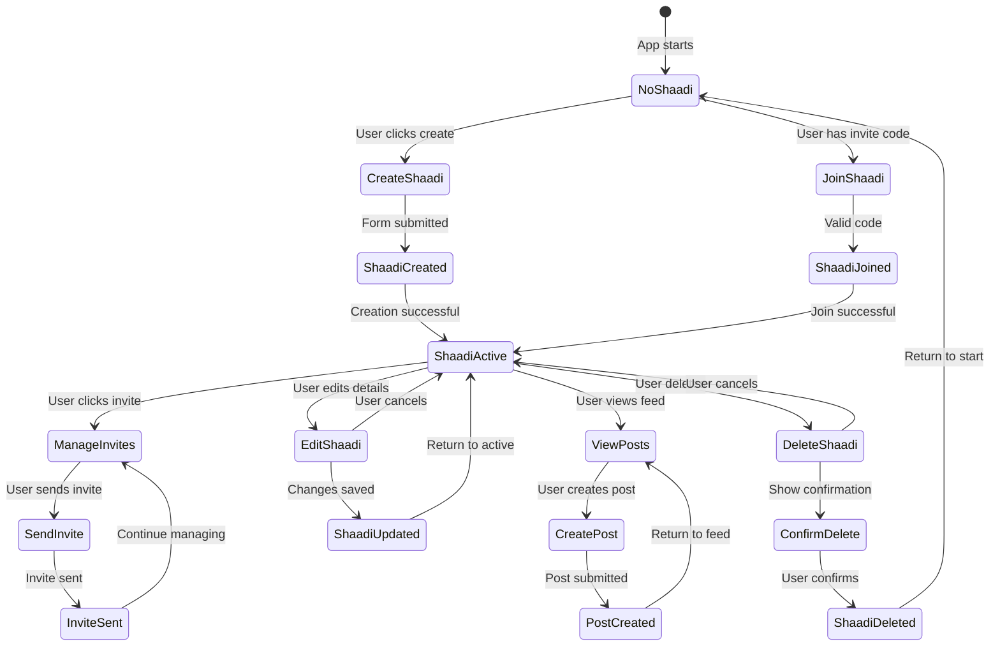

---

## Post Creation Flow

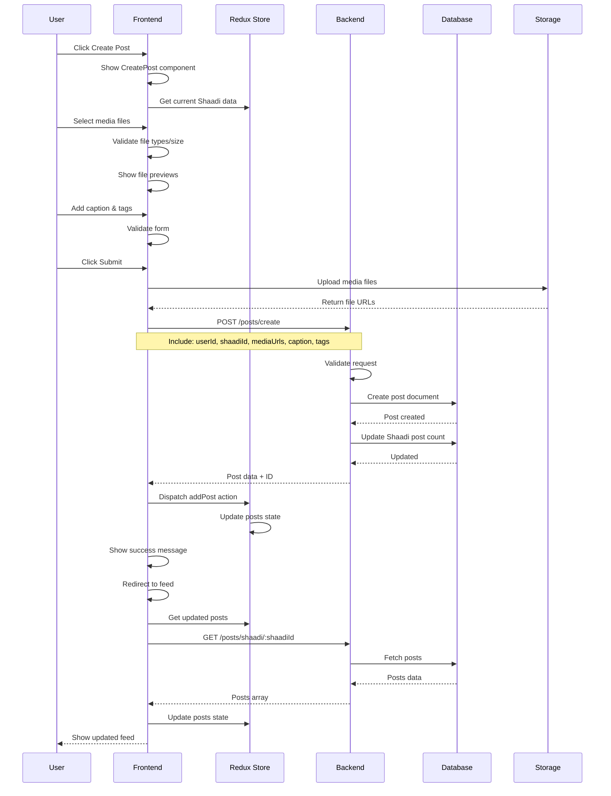

---

## Invitation System Flow

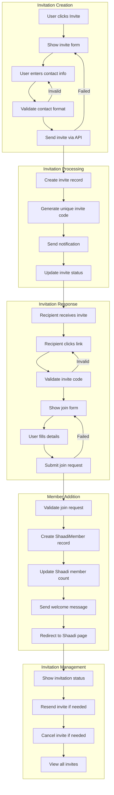

---

## Component Hierarchy Diagram

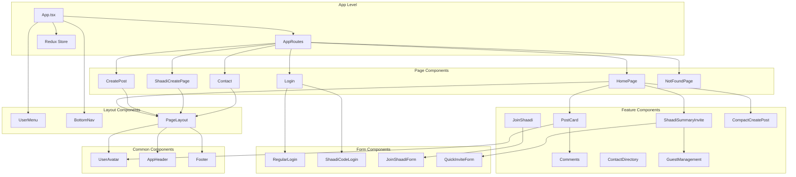

---

## Service Layer Architecture

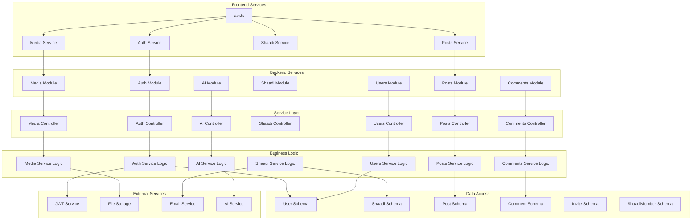

---

## Data Flow Architecture

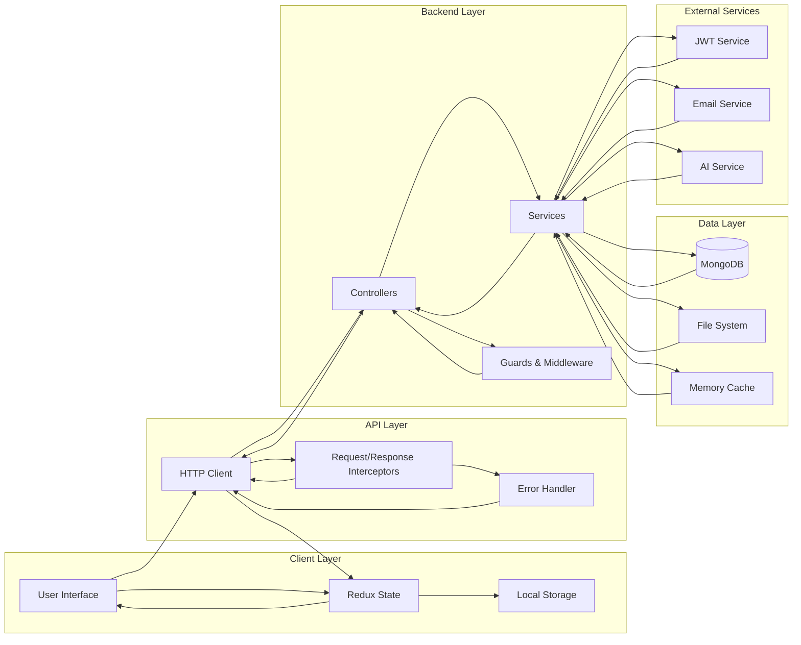

---

## Error Handling Flow

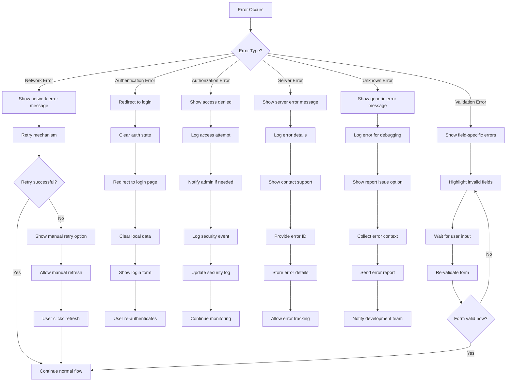

---

## Performance Optimization Flow

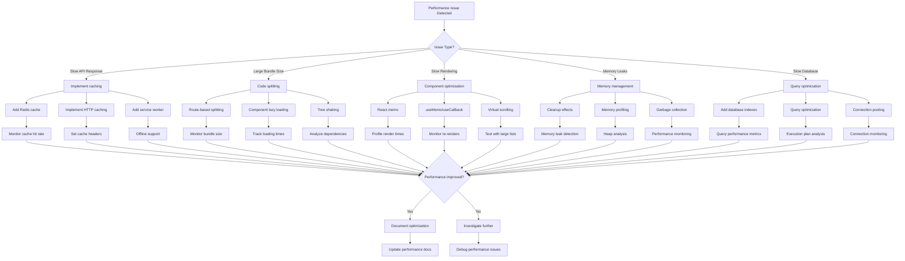

---

## Security Architecture Flow

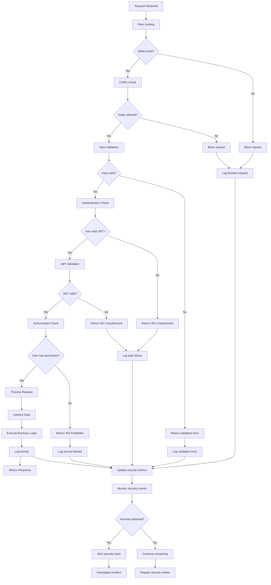

---

## Testing Strategy Diagram

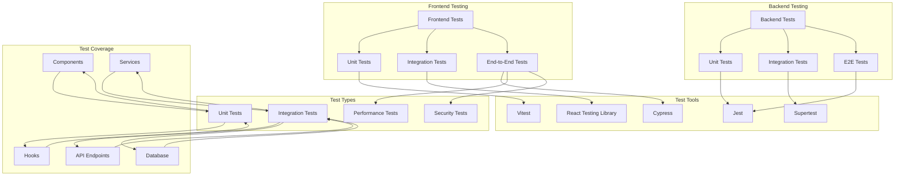

---

## Deployment Architecture

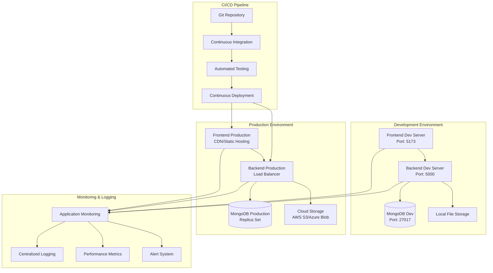

---

## Database Migration Flow

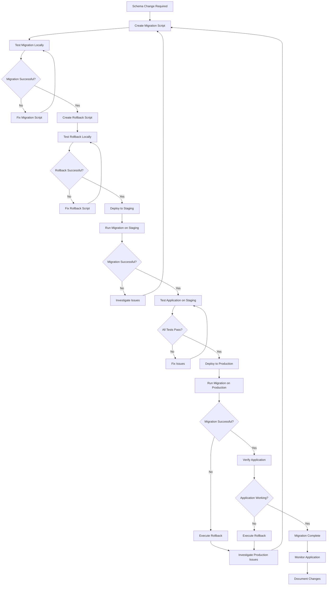

---

## API Versioning Strategy

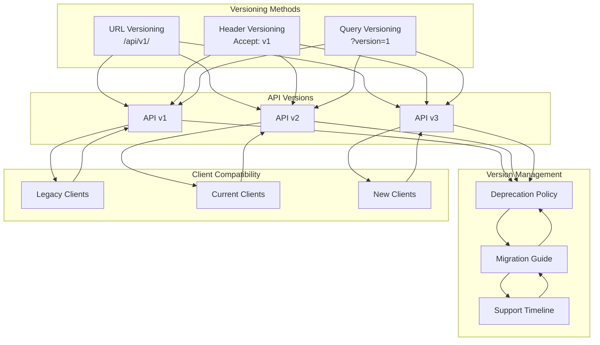

---

## Error Recovery Strategy

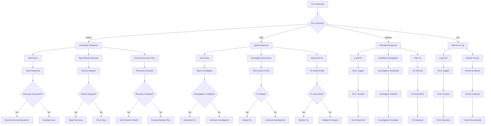

---

## Use Case Diagram

### PlantUML Version (Renderable Diagram)

```plantuml
@startuml WebMediaFeed_UseCaseDiagram
!theme plain
skinparam actorStyle awesome
skinparam usecase {
  BackgroundColor LightGreen
  BorderColor DarkGreen
  ArrowColor DarkBlue
}

title WebMediaFeed Application - Use Case Diagram

' Actors
actor "👤 User\n(Registered User)" as User
actor "👥 Guest\n(Invited Guest)" as Guest  
actor "👑 Creator\n(Shaadi Creator)" as Creator
actor "🔧 System Admin" as Admin

' Secondary Actors
actor "🤖 AI Service" as AI
actor "💾 File Storage" as Storage
actor "📧 Email Service" as Email
actor "🔐 JWT Service" as JWT
actor "🗄️ Database" as DB

' System Boundary
rectangle "WebMediaFeed System" {
  
  ' Authentication & User Management
  package "Authentication & User Management" {
    usecase "Register User" as UC1
    usecase "Login User" as UC2
    usecase "Login with Shaadi Code" as UC3
    usecase "Manage Profile" as UC4
    usecase "Change Password" as UC5
    usecase "Upload Avatar" as UC6
  }
  
  ' Shaadi Event Management
  package "Shaadi Event Management" {
    usecase "Create Shaadi Event" as UC7
    usecase "Join Shaadi Event" as UC8
    usecase "Manage Event Details" as UC9
    usecase "Delete Event" as UC10
    usecase "Switch Shaadi Context" as UC11
    usecase "View Shaadi List" as UC12
  }
  
  ' Content Management
  package "Content Management" {
    usecase "Create Post" as UC13
    usecase "Edit Post" as UC14
    usecase "Delete Post" as UC15
    usecase "Add Comment" as UC16
    usecase "Edit Comment" as UC17
    usecase "Delete Comment" as UC18
    usecase "Like Post" as UC19
    usecase "Unlike Post" as UC20
    usecase "View Feed" as UC21
    usecase "View Post Details" as UC22
  }
  
  ' Media Management
  package "Media Management" {
    usecase "Upload Media" as UC23
    usecase "Delete Media" as UC24
    usecase "View Media" as UC25
    usecase "Compress Images" as UC26
  }
  
  ' Invitation System
  package "Invitation System" {
    usecase "Send Invitation" as UC27
    usecase "Manage Guest List" as UC28
    usecase "Process Invitation Response" as UC29
    usecase "Generate Invite Code" as UC30
    usecase "Resend Invitation" as UC31
    usecase "Cancel Invitation" as UC32
  }
  
  ' Guest Management
  package "Guest Management" {
    usecase "Approve Guest Request" as UC33
    usecase "Block Member" as UC34
    usecase "Unblock Member" as UC35
    usecase "View Member List" as UC36
    usecase "Manage Member Roles" as UC37
  }
  
  ' AI Features
  package "AI Features" {
    usecase "Generate Caption" as UC38
    usecase "Moderate Content" as UC39
    usecase "Suggest Tags" as UC40
  }
  
  ' Social Features
  package "Social Features" {
    usecase "Search Users" as UC41
    usecase "View Contact Directory" as UC42
    usecase "Share Content" as UC43
    usecase "View User Profiles" as UC44
  }
}

' Primary Actor Relationships
User --> UC1
User --> UC2
User --> UC4
User --> UC5
User --> UC6
User --> UC8
User --> UC12
User --> UC13
User --> UC14
User --> UC15
User --> UC16
User --> UC17
User --> UC18
User --> UC19
User --> UC20
User --> UC21
User --> UC22
User --> UC23
User --> UC24
User --> UC25
User --> UC41
User --> UC42
User --> UC43
User --> UC44

Guest --> UC3
Guest --> UC8
Guest --> UC13
Guest --> UC16
Guest --> UC19
Guest --> UC20
Guest --> UC21
Guest --> UC22
Guest --> UC23
Guest --> UC25
Guest --> UC42
Guest --> UC44

Creator --> UC7
Creator --> UC9
Creator --> UC10
Creator --> UC27
Creator --> UC28
Creator --> UC30
Creator --> UC31
Creator --> UC32
Creator --> UC33
Creator --> UC34
Creator --> UC35
Creator --> UC36
Creator --> UC37

Admin --> UC1
Admin --> UC2
Admin --> UC4
Admin --> UC5
Admin --> UC6
Admin --> UC7
Admin --> UC8
Admin --> UC9
Admin --> UC10
Admin --> UC11
Admin --> UC12
Admin --> UC13
Admin --> UC14
Admin --> UC15
Admin --> UC16
Admin --> UC17
Admin --> UC18
Admin --> UC19
Admin --> UC20
Admin --> UC21
Admin --> UC22
Admin --> UC23
Admin --> UC24
Admin --> UC25
Admin --> UC26
Admin --> UC27
Admin --> UC28
Admin --> UC29
Admin --> UC30
Admin --> UC31
Admin --> UC32
Admin --> UC33
Admin --> UC34
Admin --> UC35
Admin --> UC36
Admin --> UC37
Admin --> UC38
Admin --> UC39
Admin --> UC40
Admin --> UC41
Admin --> UC42
Admin --> UC43
Admin --> UC44

' Secondary Actor Relationships
JWT --> UC2
JWT --> UC3
JWT --> UC8
JWT --> UC11

Email --> UC27
Email --> UC31

Storage --> UC23
Storage --> UC24
Storage --> UC25
Storage --> UC26

AI --> UC38
AI --> UC39
AI --> UC40

DB --> UC1
DB --> UC2
DB --> UC3
DB --> UC4
DB --> UC5
DB --> UC6
DB --> UC7
DB --> UC8
DB --> UC9
DB --> UC10
DB --> UC11
DB --> UC12
DB --> UC13
DB --> UC14
DB --> UC15
DB --> UC16
DB --> UC17
DB --> UC18
DB --> UC19
DB --> UC20
DB --> UC21
DB --> UC22
DB --> UC23
DB --> UC24
DB --> UC25
DB --> UC26
DB --> UC27
DB --> UC28
DB --> UC29
DB --> UC30
DB --> UC31
DB --> UC32
DB --> UC33
DB --> UC34
DB --> UC35
DB --> UC36
DB --> UC37
DB --> UC38
DB --> UC39
DB --> UC40
DB --> UC41
DB --> UC42
DB --> UC43
DB --> UC44

' Include Relationships
UC1 ..> UC2 : <<include>>
UC7 ..> UC8 : <<include>>
UC13 ..> UC23 : <<include>>
UC16 ..> UC13 : <<include>>
UC19 ..> UC13 : <<include>>
UC20 ..> UC13 : <<include>>
UC21 ..> UC13 : <<include>>
UC22 ..> UC13 : <<include>>
UC27 ..> UC30 : <<include>>
UC31 ..> UC27 : <<include>>
UC32 ..> UC27 : <<include>>
UC33 ..> UC8 : <<include>>
UC34 ..> UC36 : <<include>>
UC35 ..> UC36 : <<include>>
UC37 ..> UC36 : <<include>>

' Extend Relationships
UC38 ..> UC13 : <<extend>>
UC39 ..> UC13 : <<extend>>
UC39 ..> UC16 : <<extend>>
UC40 ..> UC13 : <<extend>>
UC26 ..> UC23 : <<extend>>
UC43 ..> UC13 : <<extend>>
UC43 ..> UC22 : <<extend>>

' Generalization Relationships
Creator --|> User
Admin --|> User
Admin --|> Creator

' Preconditions
UC2 ..> UC4 : "Pre: User exists"
UC3 ..> UC8 : "Pre: Valid invite code"
UC7 ..> UC8 : "Pre: User authenticated"
UC8 ..> UC13 : "Pre: Valid shaadi"
UC13 ..> UC16 : "Pre: User member of shaadi"
UC16 ..> UC19 : "Pre: Post exists"
UC19 ..> UC20 : "Pre: Post not already liked"
UC27 ..> UC30 : "Pre: Creator role"
UC33 ..> UC36 : "Pre: Creator role"
UC34 ..> UC36 : "Pre: Creator role"
UC35 ..> UC36 : "Pre: Creator role"

@enduml
```

### How to Render the Diagram

#### **Option 1: Online PlantUML Editor**
1. Go to [PlantUML Online Server](http://www.plantuml.com/plantuml/uml/)
2. Copy the PlantUML code above (between @startuml and @enduml)
3. Paste it into the editor
4. The diagram will render automatically

#### **Option 2: VS Code Extension**
1. Install "PlantUML" extension in VS Code
2. Create a new file with `.puml` extension
3. Paste the PlantUML code
4. Right-click and select "Preview Current Diagram"

#### **Option 3: Local PlantUML Installation**
1. Install Java Runtime Environment (JRE)
2. Download PlantUML jar file
3. Run: `java -jar plantuml.jar filename.puml`

#### **Option 4: Mermaid Version (Alternative)**
If you prefer Mermaid, the previous version is still available and can be rendered in:
- GitHub markdown files
- GitLab markdown files
- Mermaid Live Editor
- VS Code with Mermaid extension

### Use Case Descriptions

#### **Primary Actors**
- **User**: Registered users with full account access
- **Guest**: Invited users with limited access via shaadi codes
- **Creator**: Users who create and manage shaadi events
- **Admin**: System administrators with full system access

#### **Secondary Actors**
- **AI Service**: External AI service for content generation and moderation
- **File Storage**: File storage system for media uploads
- **Email Service**: Email service for sending invitations
- **JWT Service**: JWT token service for authentication
- **Database**: MongoDB database for data persistence

#### **Key Use Case Relationships**
- **<<include>>**: Required functionality that must be performed
- **<<extend>>**: Optional functionality that may be performed
- **<<generalize>>**: Inheritance relationship between actors

#### **Use Case Categories**
1. **Authentication & User Management**: User registration, login, profile management
2. **Shaadi Event Management**: Creating, joining, and managing wedding events
3. **Content Management**: Posts, comments, likes, and feed viewing
4. **Media Management**: File uploads, compression, and storage
5. **Invitation System**: Guest invitations and management
6. **Guest Management**: Member approval, blocking, and role management
7. **AI Features**: Content generation and moderation
8. **Social Features**: User search, contact directory, and sharing 