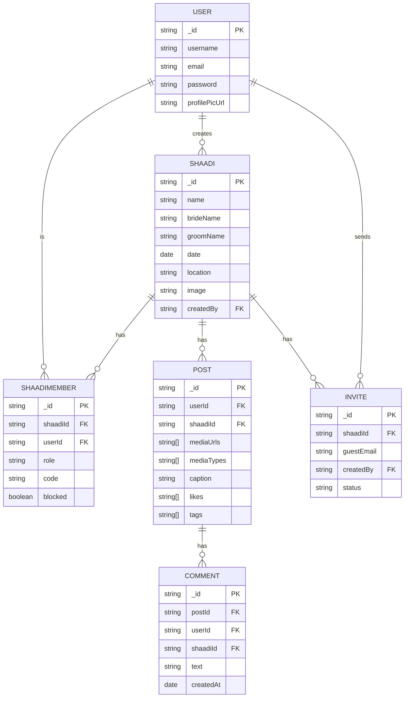
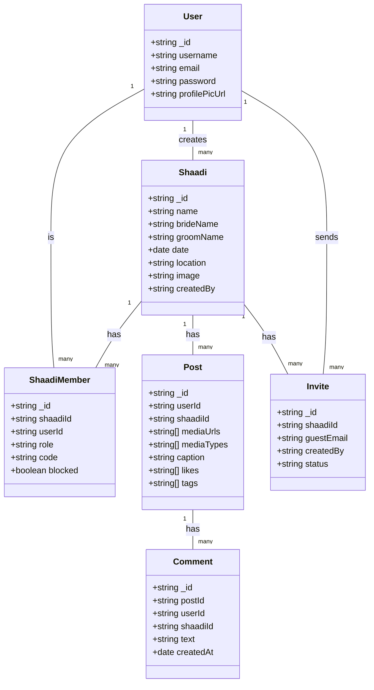

# ShaadiCircle Web Media Feed - Project Overview

## Progress

- [x] Create React project with TypeScript (using Vite)
- [x] Set up Redux Toolkit (RTK) with slices (create postSlice)
- [x] Configure routing (React Router DOM v6)
- [ ] Add styled-components for scoped and reusable styling

## Tech Stack

- React.js (with TypeScript)
- Redux Toolkit (RTK)
- styled-components
- Developed using Cursor (AI-powered code editor)
- Reusable components
- Designed for mobile and web (responsive)

## Core Features

### 1. Post Feed

- Display list of posts (image/video) like Instagram
- Infinite scroll with pagination
- Like/unlike feature with animation

### 2. Media Upload

- Upload image or video
- Store in external service (Cloudinary/Firebase)
- Show preview before posting

### 3. Comments (Phase 2)

- Add and fetch comments on each post
- Optional: Comment likes, emoji reactions

### 4. AI Features (Integrate from AI Training Project)

- Auto-caption generation
- Face detection & tagging
- Sentiment analysis on comments
- Similar post suggestion

### 5. WebView Support

- Designed mobile-first for seamless in-app WebView embedding
- Responsive UI for desktop/mobile

### 6. Reusability

- Feed component usable in other apps (plug-and-play design)
- All features encapsulated via props/config

### 7. Authentication (Phase 2 or Optional)

- Login with token-based auth (or social login)
- Like/comment only for authenticated users

## Phase 2: Shaadi Admin & Guest Wedding Flow (Wedding Management)

This phase introduces wedding management, onboarding, and approval features for Shaadi Circle. See the detailed prompt below:

```md
## 📱 ShaadiCircle — Admin to Guest Join Flow (Cursor IDE Instruction Set)

This document outlines step-by-step prompts for Cursor IDE to build the ShaadiCircle app flow starting from "Create Shaadi" to guest joining and viewing content. It ensures a shaadi-specific experience, themed for Indian weddings.

---

### 🪄 Prompt 1: Create Wedding Setup Flow (Admin-Only)
```
Create a React Native screen called `CreateShaadiScreen`. This should only be accessible to a logged-in user with the role of "Marriage Admin".

The screen should have a beautiful, cultural wedding theme (pastel pinks, blues, golds) and include a form with the following fields:
- Wedding Title
- Wedding Date(s)
- Bride Name
- Groom Name
- Upload Bride Photo
- Upload Groom Photo
- Upload Wedding Cover Image

After submission, generate a unique 6-digit code and a shareable link for this wedding event. Store all data in Firestore under a `shaadis` collection. The current user becomes the Marriage Admin of this event.
```

---

### 🪄 Prompt 2: Invitation Generation
```
After wedding creation, show the "Shaadi Invitation Page" with:
- The generated 6-digit Shaadi Code
- The Invite Link (e.g., `shaadicircle.app/join/abc123`)

Include a “Copy Link” and “Share via WhatsApp” button. This page should be accessible only to the Marriage Admin who created the shaadi.
```

---

### 🪄 Prompt 3: Guest Join Request Screen
```
Create a screen called `JoinShaadiScreen` for guests. When a guest opens the app or link, show a form with:
- Name (text input)
- Relationship (e.g., cousin, friend, etc.)
- Select side: [Bride | Groom] (radio buttons)
- Contact number (optional) with a checkbox to hide from others

This info should be submitted to Firestore under `shaadiJoinRequests`, linked to the wedding code. Guests are not auto-approved. Add a `status: "pending"` field.
```

---

### 🪄 Prompt 4: Admin Guest Approval Panel
```
Create a `GuestApprovalScreen` visible only to the Marriage Admin of a shaadi. It should list all pending join requests (from `shaadiJoinRequests`) for that wedding. Each item should show:
- Guest name, relationship, contact (if visible)
- Side selected (Groom/Bride)

Admin can Approve ✅ or Reject ❌
Once approved, move user data to `shaadiGuests` collection and allow app access.
```

---

### 🪄 Prompt 5: Post-Join Home Screen for Guests
```
Once a guest is approved, redirect them to the `ShaadiHomeScreen` showing:
- Welcome message with names of the bride and groom
- Current and upcoming event cards
- Shaadi social feed (image/video posts from other guests)

Use Firestore to load events from `shaadiEvents` and posts from `shaadiPosts`. This screen should clearly indicate which shaadi they are part of (title bar or badge).
```

---

### 🪄 Prompt 6: Role-based Access Control
```
Implement access checks throughout the app:
- Marriage Admins can create events, manage guests, pin announcements
- Guests can only post, comment, view events, and browse contacts

Store `role: admin` or `guest` with each user under the specific shaadi.
```

---

### 🪄 Prompt 7: Add Shaadi Branding
```
Style all these screens with a consistent Shaadi theme:
- Use colors like pastel pink (#FADADD), peacock blue (#1F3A93), and saffron (#FF9933)
- Apply light traditional Indian patterns in background (SVG, blur overlays)
- Use festive fonts (like "Poppins" for text and "Yatra One" for shaadi headers)
```

---

> ✅ You can copy-paste each prompt individually into Cursor IDE to build out the entire wedding-specific onboarding experience.
```
```

## Future Features

- Post sharing (with QR code or link)
- Guest-specific feed filter
- Admin moderation dashboard

# Project Documentation

## Entity-Relationship (ER) Diagram



---

## Class Diagram



---

*Diagrams are in Mermaid syntax. You can visualize them using any Mermaid-compatible tool or VSCode extension.*

